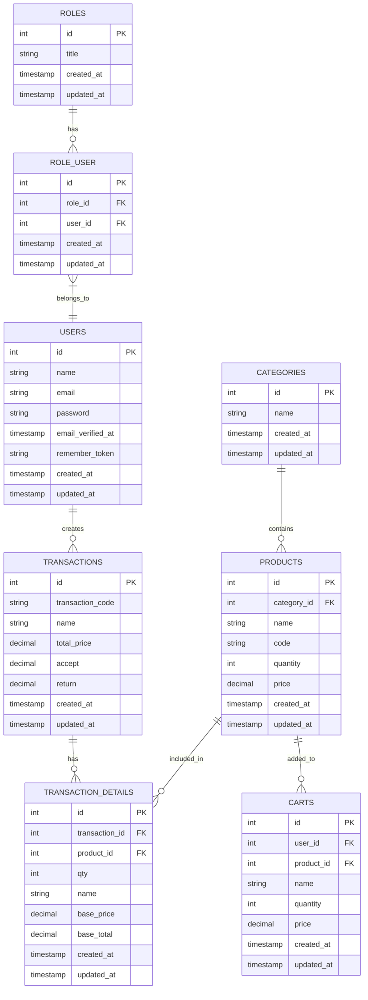

# Struktur Database POS Depot Air Minum

## Diagram Entity Relationship (ERD)



## Penjelasan Tabel

### 1. Users

-   Menyimpan data pengguna sistem
-   Terhubung dengan roles melalui role_user
-   Primary key: id
-   Relasi:
    -   One-to-Many dengan Transactions
    -   Many-to-Many dengan Roles melalui role_user

### 2. Roles

-   Menyimpan daftar peran pengguna (Admin, Kasir, dll)
-   Primary key: id
-   Relasi:
    -   Many-to-Many dengan Users melalui role_user

### 3. Role_User

-   Tabel pivot untuk relasi Users dan Roles
-   Primary key: id
-   Foreign keys:
    -   role_id ke Roles
    -   user_id ke Users

### 4. Categories

-   Menyimpan kategori produk
-   Primary key: id
-   Relasi:
    -   One-to-Many dengan Products

### 5. Products

-   Menyimpan data produk
-   Primary key: id
-   Foreign key: category_id ke Categories
-   Relasi:
    -   Many-to-One dengan Categories
    -   One-to-Many dengan Transaction_Details
    -   One-to-Many dengan Carts

### 6. Transactions

-   Menyimpan data transaksi
-   Primary key: id
-   Relasi:
    -   One-to-Many dengan Transaction_Details

### 7. Transaction_Details

-   Menyimpan detail item dalam transaksi
-   Primary key: id
-   Foreign keys:
    -   transaction_id ke Transactions
    -   product_id ke Products
-   Relasi:
    -   Many-to-One dengan Transactions
    -   Many-to-One dengan Products

### 8. Carts

-   Menyimpan item dalam keranjang belanja
-   Primary key: id
-   Foreign keys:
    -   user_id ke Users
    -   product_id ke Products
-   Relasi:
    -   Many-to-One dengan Users
    -   Many-to-One dengan Products

## Indeks Database

### Products

```sql
CREATE INDEX idx_product_code ON products(code);
CREATE INDEX idx_product_category ON products(category_id);
```

### Transactions

```sql
CREATE INDEX idx_transaction_code ON transactions(transaction_code);
CREATE INDEX idx_transaction_date ON transactions(created_at);
```

### Transaction_Details

```sql
CREATE INDEX idx_transaction_details_transaction ON transaction_details(transaction_id);
CREATE INDEX idx_transaction_details_product ON transaction_details(product_id);
```

## Constraints

### Foreign Key Constraints

```sql
ALTER TABLE products
ADD CONSTRAINT fk_product_category
FOREIGN KEY (category_id) REFERENCES categories(id)
ON DELETE RESTRICT
ON UPDATE CASCADE;

ALTER TABLE transaction_details
ADD CONSTRAINT fk_transaction_details_transaction
FOREIGN KEY (transaction_id) REFERENCES transactions(id)
ON DELETE CASCADE
ON UPDATE CASCADE;

ALTER TABLE transaction_details
ADD CONSTRAINT fk_transaction_details_product
FOREIGN KEY (product_id) REFERENCES products(id)
ON DELETE RESTRICT
ON UPDATE CASCADE;

ALTER TABLE carts
ADD CONSTRAINT fk_cart_user
FOREIGN KEY (user_id) REFERENCES users(id)
ON DELETE CASCADE
ON UPDATE CASCADE;

ALTER TABLE carts
ADD CONSTRAINT fk_cart_product
FOREIGN KEY (product_id) REFERENCES products(id)
ON DELETE CASCADE
ON UPDATE CASCADE;
```

## Trigger

### Update Stok Produk

```sql
DELIMITER //
CREATE TRIGGER after_transaction_detail_insert
AFTER INSERT ON transaction_details
FOR EACH ROW
BEGIN
    UPDATE products
    SET quantity = quantity - NEW.qty
    WHERE id = NEW.product_id;
END;//
DELIMITER ;
```

### Validasi Stok

```sql
DELIMITER //
CREATE TRIGGER before_transaction_detail_insert
BEFORE INSERT ON transaction_details
FOR EACH ROW
BEGIN
    DECLARE current_stock INT;
    SELECT quantity INTO current_stock
    FROM products
    WHERE id = NEW.product_id;

    IF current_stock < NEW.qty THEN
        SIGNAL SQLSTATE '45000'
        SET MESSAGE_TEXT = 'Stok tidak mencukupi';
    END IF;
END;//
DELIMITER ;
```

## Backup Strategy

### Daily Backup

```bash
#!/bin/bash
mysqldump -u [username] -p[password] [database] > backup_$(date +%Y%m%d).sql
```

### Restore Database

```bash
mysql -u [username] -p[password] [database] < backup_file.sql
```
