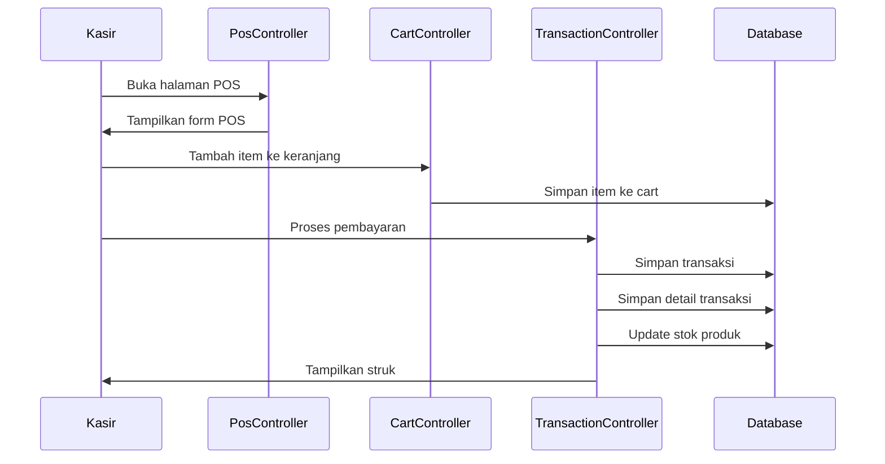
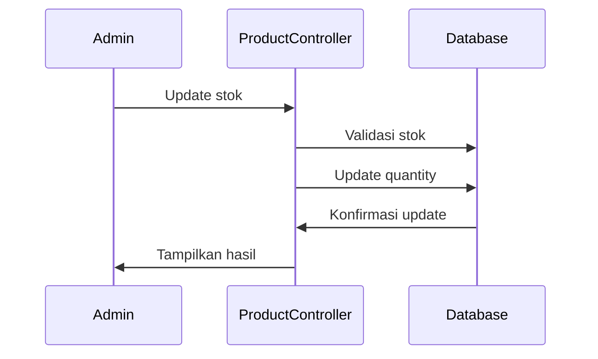

# Dokumentasi Pengembang POS Depot Air Minum

## Arsitektur Aplikasi

### Pattern yang Digunakan

-   MVC (Model-View-Controller)
-   Repository Pattern untuk akses data
-   Service Pattern untuk logika bisnis
-   Middleware untuk autentikasi dan otorisasi

### Struktur Database

#### Users

```sql
CREATE TABLE users (
    id bigint(20) UNSIGNED NOT NULL AUTO_INCREMENT,
    name varchar(255) NOT NULL,
    email varchar(255) NOT NULL,
    email_verified_at timestamp NULL DEFAULT NULL,
    password varchar(255) NOT NULL,
    remember_token varchar(100) DEFAULT NULL,
    created_at timestamp NULL DEFAULT NULL,
    updated_at timestamp NULL DEFAULT NULL,
    PRIMARY KEY (id)
);
```

#### Products

```sql
CREATE TABLE products (
    id bigint(20) UNSIGNED NOT NULL AUTO_INCREMENT,
    category_id bigint(20) UNSIGNED NOT NULL,
    name varchar(255) NOT NULL,
    code varchar(255) NOT NULL,
    quantity int(11) NOT NULL,
    price decimal(15,2) NOT NULL,
    created_at timestamp NULL DEFAULT NULL,
    updated_at timestamp NULL DEFAULT NULL,
    PRIMARY KEY (id)
);
```

#### Transactions

```sql
CREATE TABLE transactions (
    id bigint(20) UNSIGNED NOT NULL AUTO_INCREMENT,
    transaction_code varchar(255) NOT NULL,
    name varchar(255) NOT NULL,
    total_price decimal(15,2) NOT NULL,
    accept decimal(15,2) NOT NULL,
    return decimal(15,2) NOT NULL,
    created_at timestamp NULL DEFAULT NULL,
    updated_at timestamp NULL DEFAULT NULL,
    PRIMARY KEY (id)
);
```

#### Transaction Details

```sql
CREATE TABLE transaction_details (
    id bigint(20) UNSIGNED NOT NULL AUTO_INCREMENT,
    transaction_id bigint(20) UNSIGNED NOT NULL,
    product_id bigint(20) UNSIGNED NOT NULL,
    qty int(11) NOT NULL,
    name varchar(255) NOT NULL,
    base_price decimal(15,2) NOT NULL,
    base_total decimal(15,2) NOT NULL,
    created_at timestamp NULL DEFAULT NULL,
    updated_at timestamp NULL DEFAULT NULL,
    PRIMARY KEY (id)
);
```

## Alur Kerja Aplikasi

### 1. Proses Transaksi



### 2. Manajemen Stok



## Komponen Utama

### 1. Helper Functions

```php
// App\Helpers\Helper.php
class Helper {
    public static function formatRupiah($nominal) {
        return 'Rp ' . number_format($nominal, 0, ',', '.');
    }
}
```

### 2. Middleware

```php
// App\Http\Middleware\IsAdmin.php
public function handle($request, Closure $next)
{
    if (auth()->check() && auth()->user()->hasRole('admin')) {
        return $next($request);
    }
    return redirect('/');
}
```

### 3. Service Classes

```php
// App\Services\TransactionService.php
class TransactionService {
    public function createTransaction($data) {
        DB::beginTransaction();
        try {
            // Create transaction logic
            DB::commit();
        } catch (\Exception $e) {
            DB::rollback();
            throw $e;
        }
    }
}
```

## Event & Listeners

### 1. Events

```php
// App\Events\TransactionCreated.php
class TransactionCreated
{
    public $transaction;

    public function __construct($transaction)
    {
        $this->transaction = $transaction;
    }
}
```

### 2. Listeners

```php
// App\Listeners\UpdateProductStock.php
class UpdateProductStock
{
    public function handle(TransactionCreated $event)
    {
        // Update stock logic
    }
}
```

## Validasi

### 1. Form Request

```php
// App\Http\Requests\ProductRequest.php
class ProductRequest extends FormRequest
{
    public function rules()
    {
        return [
            'name' => 'required|string|max:255',
            'code' => 'required|unique:products,code,' . $this->product,
            'price' => 'required|numeric|min:0',
            'quantity' => 'required|integer|min:0'
        ];
    }
}
```

## Testing

### 1. Unit Tests

```php
// tests/Unit/ProductTest.php
class ProductTest extends TestCase
{
    public function test_can_create_product()
    {
        $product = Product::factory()->create();
        $this->assertDatabaseHas('products', ['id' => $product->id]);
    }
}
```

### 2. Feature Tests

```php
// tests/Feature/TransactionTest.php
class TransactionTest extends TestCase
{
    public function test_can_create_transaction()
    {
        $response = $this->post('/admin/transactions', $data);
        $response->assertStatus(302);
    }
}
```

## Deployment

### 1. Persiapan Production

```bash
# Optimize autoloader
composer install --optimize-autoloader --no-dev

# Optimize configuration loading
php artisan config:cache

# Optimize route loading
php artisan route:cache

# Optimize view loading
php artisan view:cache
```

### 2. Cron Jobs

```crontab
* * * * * cd /path-to-project && php artisan schedule:run >> /dev/null 2>&1
```

## Panduan Kontribusi

### 1. Coding Standards

-   Mengikuti PSR-12
-   Menggunakan Laravel coding style
-   Dokumentasi untuk setiap method
-   Type hinting untuk parameter dan return type

### 2. Git Workflow

```bash
# Create new feature branch
git checkout -b feature/nama-fitur

# Commit changes
git add .
git commit -m "feat: deskripsi fitur"

# Push changes
git push origin feature/nama-fitur
```

### 3. Code Review Checklist

-   [ ] Kode mengikuti standar PSR-12
-   [ ] Unit test telah dibuat
-   [ ] Dokumentasi telah diupdate
-   [ ] Tidak ada security vulnerability
-   [ ] Performance impact minimal

## Monitoring & Logging

### 1. Log Format

```php
Log::info('Transaction created', [
    'transaction_id' => $transaction->id,
    'total' => $transaction->total_price,
    'user' => auth()->user()->name
]);
```

### 2. Error Tracking

```php
try {
    // Process logic
} catch (\Exception $e) {
    Log::error('Error processing transaction', [
        'error' => $e->getMessage(),
        'trace' => $e->getTraceAsString()
    ]);
}
```

## Performance Optimization

### 1. Database Indexing

```sql
CREATE INDEX idx_product_code ON products(code);
CREATE INDEX idx_transaction_code ON transactions(transaction_code);
```

### 2. Caching Strategy

```php
// Cache product data
Cache::remember('products', 3600, function () {
    return Product::all();
});
```

## Security Measures

### 1. Input Validation

```php
$validated = $request->validate([
    'email' => 'required|email',
    'password' => 'required|min:8'
]);
```

### 2. XSS Prevention

```php
// In Blade templates
{{ $data }} // Auto-escaped
{!! $data !!} // Raw output, use with caution
```

### 3. CSRF Protection

```php
// In forms
@csrf
```
