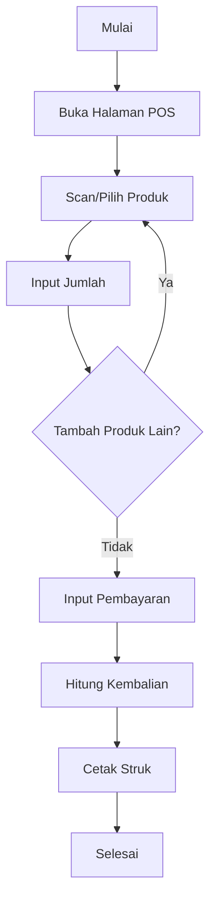
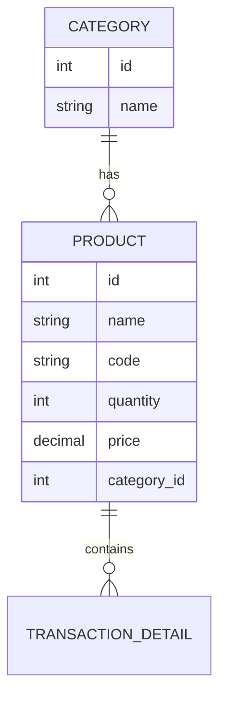
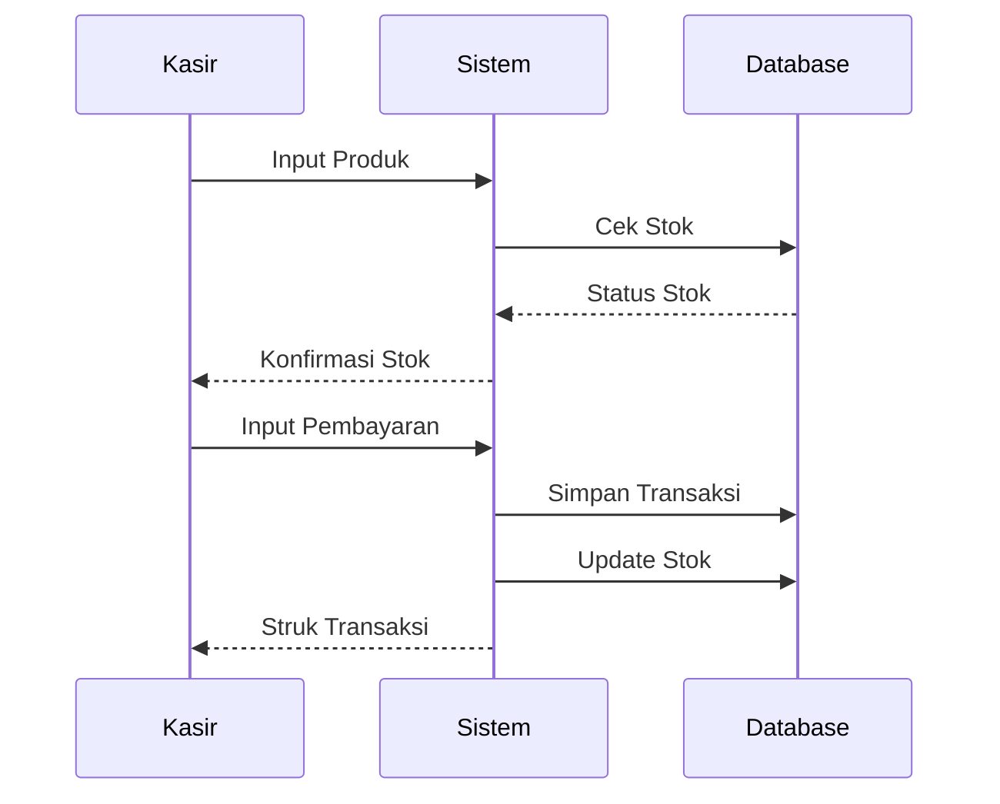
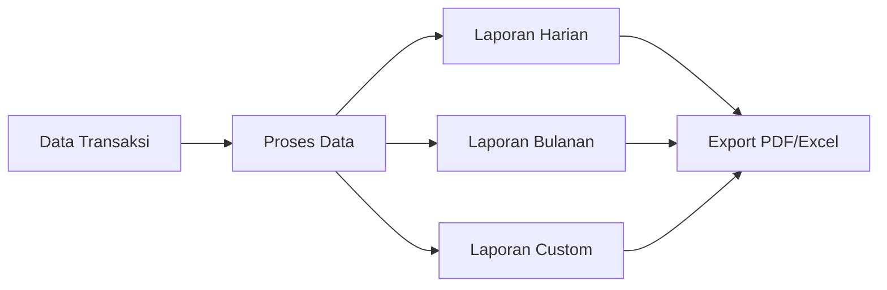
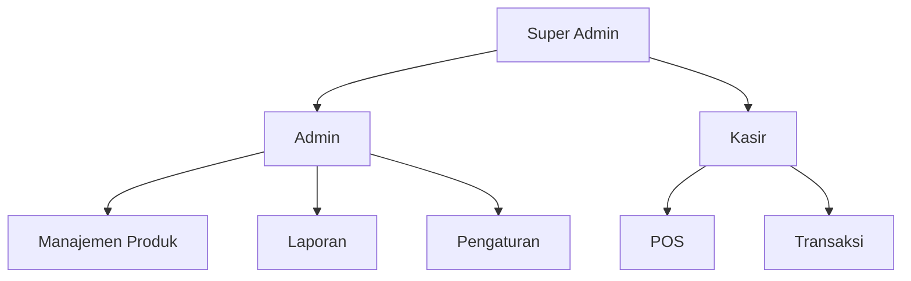
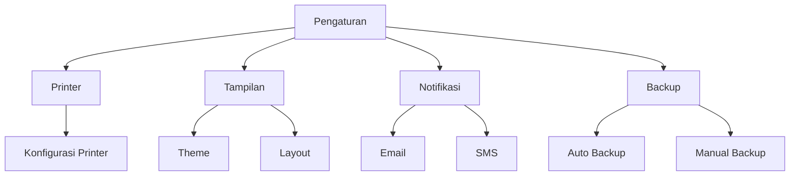

# Dokumentasi Fitur Aplikasi POS Depot Air Minum

## Daftar Isi

1. [Point of Sale (POS)](#point-of-sale)
2. [Manajemen Produk](#manajemen-produk)
3. [Manajemen Transaksi](#manajemen-transaksi)
4. [Laporan](#laporan)
5. [Manajemen Pengguna](#manajemen-pengguna)

## Point of Sale (POS)

### Deskripsi

Fitur Point of Sale (POS) adalah sistem kasir yang memungkinkan pengguna untuk melakukan transaksi penjualan dengan cepat dan efisien.

### Diagram Alur POS

### Fitur Utama

1. **Pencarian Produk**

    - Pencarian dengan barcode scanner
    - Pencarian manual dengan nama/kode
    - Auto-complete suggestions

2. **Keranjang Belanja**

    - Tambah/hapus item
    - Update jumlah
    - Kalkulasi otomatis
    - Diskon per item (opsional)

3. **Pembayaran**

    - Input jumlah pembayaran
    - Kalkulasi kembalian otomatis
    - Multiple payment methods (cash/non-cash)

4. **Cetak Struk**
    - Format struk custom
    - Print preview
    - Cetak ulang

## Manajemen Produk

### Deskripsi

Sistem pengelolaan produk yang memungkinkan pengguna untuk menambah, mengubah, dan menghapus produk serta mengatur stok.

### Diagram Entity Relationship

### Fitur Utama

1. **Katalog Produk**

    - Daftar produk
    - Filter & sorting
    - Pencarian produk

2. **Manajemen Stok**

    - Update stok
    - Notifikasi stok minimum
    - History perubahan stok

3. **Kategori Produk**
    - Pengelompokan produk
    - Hierarki kategori
    - Filter berdasarkan kategori

## Manajemen Transaksi

### Deskripsi

Sistem pencatatan dan pengelolaan transaksi yang memungkinkan pelacakan semua penjualan.

### Diagram Alur Transaksi

### Fitur Utama

1. **Riwayat Transaksi**

    - Daftar semua transaksi
    - Filter berdasarkan tanggal
    - Detail per transaksi

2. **Detail Transaksi**

    - Informasi produk
    - Jumlah dan harga
    - Total pembayaran

3. **Pembatalan Transaksi**
    - Pembatalan dengan otorisasi
    - Pencatatan alasan pembatalan
    - Pemulihan stok otomatis

## Laporan

### Deskripsi

Sistem pelaporan yang menyediakan insight bisnis dan analisis penjualan.

### Diagram Alur Laporan

### Fitur Utama

1. **Laporan Penjualan**

    - Laporan harian
    - Laporan bulanan
    - Laporan periode custom
    - Grafik penjualan

2. **Laporan Produk**

    - Produk terlaris
    - Stok menipis
    - Pergerakan stok

3. **Laporan Keuangan**
    - Total pendapatan
    - Analisis trend
    - Perbandingan periode

## Manajemen Pengguna

### Deskripsi

Sistem manajemen pengguna dengan multi-level akses dan otorisasi.

### Diagram Hak Akses

### Fitur Utama

1. **Manajemen Role**

    - Super Admin
    - Admin
    - Kasir
    - Custom roles

2. **Hak Akses**

    - Kontrol akses per modul
    - Pembatasan fitur
    - Log aktivitas

3. **Keamanan**
    - Autentikasi
    - Reset password
    - Session management

## Pengaturan Sistem

### Deskripsi

Konfigurasi sistem untuk menyesuaikan dengan kebutuhan bisnis.

### Diagram Konfigurasi

### Fitur Utama

1. **Konfigurasi Printer**

    - Setup printer
    - Template struk
    - Test print

2. **Tampilan**

    - Tema aplikasi
    - Layout custom
    - Bahasa sistem

3. **Backup & Restore**
    - Backup otomatis
    - Backup manual
    - Restore data
